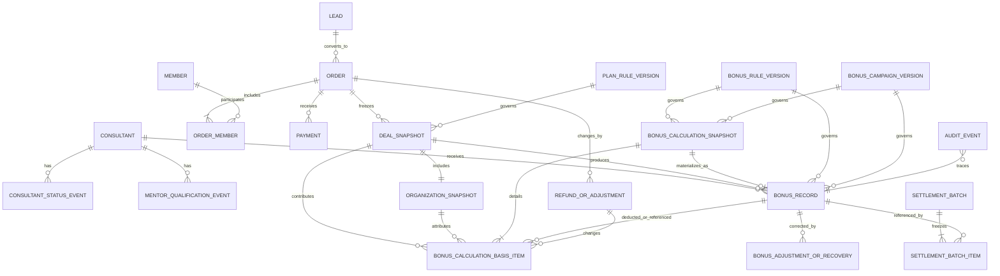

# Task 04A-3A：獎金核心資料模型與快照規格

## 1. 文件目的與邊界

### 1.1 文件資訊

| 項目 | 內容 |
|---|---|
| 文件狀態 | 邏輯資料模型規格草案，待審核 |
| 文件版本 | v1.0-draft |
| 建立日期 | 2026-06-27 |
| 上游依據 | `docs/task-04a-1-bonus-policy-spec.md`、`docs/task-04a-2-sheet-gap-analysis.md` |
| 適用範圍 | 顧問獎金所需的資料權責、邏輯實體、不可變快照、版本、追溯、隱私及後續設計邊界 |

本文件定義的是邏輯資料模型，不代表已建立或修改任何正式 Google Sheet、Apps Script、前端、API 或資料。邏輯實體可在後續設計中落到 Sheet、資料庫或其他儲存方式；本文件不決定實體分頁數量、正式欄位名稱或部署方式。

### 1.2 規則標記

| 標記 | 意義 |
|---|---|
| 已確認制度 | Task 04A-1 已封版的營運規則，不由本文件改寫 |
| 技術設計建議 | 為滿足追溯、防重及稽核所提出的邏輯設計，仍須後續審核後實作 |
| 尚待決策 | 營運、法律、財務或實體儲存方式尚未確認，不得當成正式規則 |

### 1.3 邊界

- 不新增、刪減或修改任何獎金金額、門檻、計算公式或營運資格。
- 不設計完整獎金狀態機、批次操作畫面或正式欄位遷移指令；這些屬下一階段。
- 不讀寫正式 Sheet，不處理正式資料清理，也不判定既有資料列是否正確。
- 不解決 HC9001 的 90 天推薦保護正式 Web App 寫入異常。
- 不把現有 Sheet 的摘要欄位直接認定為正式計算主來源。

## 2. 資料來源權責矩陣

「唯一權威來源」是指某項事實在計算與稽核時應以哪一個邏輯實體為準；其他畫面或欄位可以保存摘要，但不得反向覆蓋權威事實。

| 資料事實 | 唯一權威來源 | 可用的衍生摘要 | 不得作唯一依據 |
|---|---|---|---|
| 顧問基本身分與目前狀態 | `consultant` | 顧問大廳顯示資料 | lead 或訂單上的顧問姓名、獎金資格旗標 |
| 顧問停權、終止等歷史 | `consultant_status_event` | `consultant` 的目前狀態 | 只看目前狀態或最後更新時間 |
| 導師晉升、暫停、喪失、恢復 | `mentor_qualification_event`；`consultant` 只存目前摘要 | 目前位階、導師資格狀態 | 本季人數、連續未達季數或可領獎布林值本身 |
| lead 與 90 天推薦保護來源資料 | `lead` 及其可稽核的歸屬判定歷程 | lead 目前歸屬與保護狀態 | CRM 階段、目前顧問欄位 |
| 成交時最終推薦歸屬與保護判定 | `deal_snapshot` | 訂單或獎金顯示摘要 | 日後可能變動的 lead 目前值 |
| 會員身分 | `member` | 訂單成員遮罩顯示 | lead 姓名或訂單客戶姓名 |
| 訂單與成交方案 | `order` | lead 的轉換訂單ID | lead 的成交金額或是否付款 |
| 訂單參與會員 | `order_member` | order 的人數合計 | order 單一會員ID或手填人數 |
| 每筆收款與入帳確認 | `payment` | order 的累計已收、未收餘額、付款狀態 | 單一付款日期、是否付款 |
| 退款、取消、降級與方案調整 | `refund_or_adjustment` | order 的目前摘要狀態 | 直接覆寫原訂單金額、方案或付款紀錄 |
| 目前組織關係 | 經核准的組織關係資料；實作前須決定承載方式 | consultant 的上層與組織路徑摘要 | 姓名欄、目前上層欄作歷史證據 |
| 成交時組織關係 | `organization_snapshot` | deal snapshot 的最近有效導師摘要 | 日後變動的目前組織 |
| 方案公式與版本 | `plan_rule_version` | plans 的目前版本顯示 | 訂單上的方案名稱、手填推廣獎金 |
| 常態獎金制度版本 | `bonus_rule_version` | 管理端規則摘要 | 程式碼中的固定金額或門檻 |
| 活動獎金版本 | `bonus_campaign_version` | 活動目前狀態與顯示名稱 | 程式碼寫死的活動期間、級距或適用對象 |
| 每一筆獎金 | `bonus_record` | order 的是否已產生獎金、顧問大廳合計 | order 或 consultant 的獎金摘要 |
| 期間彙總獎金的完整計算結果 | `bonus_calculation_snapshot` | bonus record 的試算金額及顧問大廳月結合計 | 只有合計件數、合計金額或單一 source_order_id 的獎金列 |
| 期間彙總獎金的納入、扣除及排除明細 | `bonus_calculation_basis_item` | 月結報表的件數／扣除摘要 | 無法逐筆回連來源的手工合計 |
| 週結、月結及撥款批次 | `settlement_batch` 及不可變批次明細 | bonus record 的目前批次摘要 | 單筆訂單上的結算月份、撥款狀態或可覆寫的單一批次ID |
| 人工調整與追回 | `bonus_adjustment_or_recovery` | bonus record 的調整／追回彙總 | 直接改寫原始試算或已發放金額 |
| 所有敏感操作與狀態異動 | `audit_event` | 建立人、最後更新人 | 只保留最後更新時間 |

組織關係目前已有顧問主檔欄位，但 Task 04A-2 證據不足以確認其歷史承載方式。技術上必須能依指定時間還原關係，且成交時另存不可變 `organization_snapshot`；是否新增獨立組織關係實體或沿用既有結構，列為 Task 04A-3 後續設計決策。

## 3. 核心邏輯實體

### 3.1 共通原則

- 所有主鍵必須為穩定、不可重用的系統識別，不以姓名、手機、LINE UID 或可變業務名稱作主鍵。
- 所有時間應同時保存明確時間值與時區；獎金週期判定採 Task 04A-1 已確認的 `Asia/Taipei` 規則。
- 金額須保存幣別；件數須可精確表達 `0.5`，不得使用可能產生浮點誤差的表示方式。
- 「不可變」代表建立後不得直接覆寫；修正必須新增後繼版本、調整、撤銷或稽核事件。
- 下表的保留策略為技術設計建議。實際法定年限須待法律、會計及稅務確認。

### 3.2 身分、資格與 CRM 實體

| 實體 | 用途與主鍵 | 重要欄位群組 | 關係 | 可變性 | 敏感性 | 歷史與保留策略 |
|---|---|---|---|---|---|---|
| `consultant` | 顧問主檔；`consultant_id` | 基本識別、合作狀態摘要、目前位階、目前導師資格、目前組織摘要、權限狀態 | 對多個狀態事件、資格事件、lead、訂單及獎金 | 基本資料可依權限更新；ID 不可變；目前狀態由事件推導 | 含個資；金融資料應分權隔離 | 合作期間及法定稽核期保留；被獎金引用的識別不得刪除 |
| `consultant_status_event` | 保存啟用、停權、終止及恢復等合作事件；`consultant_status_event_id` | 前後狀態、生效時間、原因、決議、操作者、覆核者、佐證引用 | 多對一 consultant；可被 deal snapshot 引用其當時狀態 | 不可變；更正用反向／後繼事件 | 內部機密，可能含違規資訊 | 永久保留於仍有交易或獎金追溯需求的期間；不可硬刪除 |
| `mentor_qualification_event` | 保存晉升、季度維護、過渡季、暫停、喪失及恢復；`mentor_qualification_event_id` | 事件類型、考核期、有效會員數／件數依據、生效時間、資格結果、核准與佐證 | 多對一 consultant；供成交時資格判斷 | 不可變；後續資格以新事件表示 | 內部機密 | 保留完整事件鏈；被快照引用後永久鎖定 |
| `lead` | CRM 與推薦來源；`lead_id` | 來源、推薦碼、首次／目前歸屬、保護起訖與判定、爭議、轉換關聯 | 可連到 member、order、consultant；成交時資料被 deal snapshot 固化 | CRM 欄位可更新；歸屬變更須留事件或稽核 | 含會員個資、LINE 識別及可能的健康資訊；獎金模型不得複製健康內容 | 依個資及 CRM 政策保留；成交歸屬證據另由快照長期保存 |
| `member` | 正式會員身分；`member_id` | 身分識別、聯絡資料、會員狀態、同意與遮罩顯示資料 | 可參與多個 order_member；可由 lead 轉換 | 身分資料可依法更正；ID 與交易關聯不可變 | 高敏感個資；健康資料應在其他權限域 | 依會員、法律及交易保留政策；獎金端只引用 ID 與必要遮罩資料 |

### 3.3 交易、付款與規則實體

| 實體 | 用途與主鍵 | 重要欄位群組 | 關係 | 可變性 | 敏感性 | 歷史與保留策略 |
|---|---|---|---|---|---|---|
| `order` | 保存案件、應收與目前交易摘要；`order_id` | lead／客戶關聯、方案引用、幣別、應收金額、契約完成、目前狀態、成交時間摘要 | 一對多 order_member、payment、refund_or_adjustment、bonus_record；一對一或一對多快照版本 | 成交前可依流程更新；成交後核心事實不得直接覆寫 | 含交易與部分個資 | 依法定交易／會計期間保留；有獎金關聯者不得硬刪除 |
| `order_member` | 表達家庭與企業的一訂單多會員；`order_member_id` | order_id、member_id、成員角色、加入／退出狀態、有效認列與時間 | 多對一 order、多對一 member | 成交前可調整；成交後以調整事件及新快照處理 | 含會員關聯，屬個資 | 與訂單同期間保留；歷史成員不可直接刪除 |
| `payment` | 保存每筆應收款的實際收款及公司入帳確認；`payment_id` | order_id、金額、幣別、付款方式、交易日期、入帳狀態、確認人與確認時間、外部憑證引用 | 多對一 order；可被退款／調整引用 | 不可覆寫已確認入帳事實；沖正或更正新增事件 | 高敏感金融／付款資料 | 依法定會計、稅務及金流要求保留；限制查詢與記錄存取 |
| `refund_or_adjustment` | 保存退款、取消、降級、換方案及訂單層調整；`refund_or_adjustment_id` | 類型、原 order／payment、關聯新 order、金額、人數、方案前後值、原因、狀態、核准與時間 | 多對一 order；可觸發 bonus adjustment/recovery | 不可變；後續處理用新事件或狀態事件 | 金融及營運機密 | 與原交易及受影響獎金共同保留，不刪除原紀錄 |
| `plan_rule_version` | 版本化方案人數、價格、基本獎金及件數公式；`plan_rule_version_id` | 方案族群、版本、適用人數、公式／參數、幣別、件數精度、生失效時間、版本狀態、核准資訊 | 被 order、deal_snapshot、bonus_record 引用 | 草稿可改；核准或被引用後不可變 | 制度資料，非個資 | 歷史版本永久保留；停用不刪除 |
| `bonus_rule_version` | 版本化常態獎金、導師及組織規則；`bonus_rule_version_id` | 規則類型、條件、金額／參數、資格、週期、生失效時間、狀態、前版與核准資訊 | 被 deal_snapshot、bonus_calculation_snapshot 及 bonus_record 引用 | 草稿可改；核准或被引用後不可變 | 制度資料，非個資 | 歷史版本永久保留 |
| `bonus_campaign_version` | 版本化頂尖獵人及其他期間活動；`bonus_campaign_version_id` | campaign_id、活動期別、名稱、期間、時區、週期、歸零、門檻級距、金額、適用角色／位階／方案、併領／擇優、狀態與核准 | 被 deal_snapshot、bonus_calculation_snapshot 及活動 bonus_record 引用 | 草稿可改；核准或被引用後不可變 | 制度資料，非個資 | 同名不同期分開識別；所有歷史版本永久保留 |

### 3.4 快照、獎金、結算與稽核實體

| 實體 | 用途與主鍵 | 重要欄位群組 | 關係 | 可變性 | 敏感性 | 歷史與保留策略 |
|---|---|---|---|---|---|---|
| `deal_snapshot` | 全額入帳確認時固化成交與計獎輸入；`deal_snapshot_id` | 訂單、方案、人數、金額、件數、推薦保護、最終顧問、資格、規則版本、入帳日與時區 | 屬於 order；引用 organization_snapshot 及各規則版本；可直接產生成交型 bonus_record，亦可成為期間彙總 basis item | 不可變；退款或更正另建調整及必要的新快照版本，原快照保留 | 含交易、顧問與有限會員資訊 | 與所有衍生獎金及法定稽核需求共同保留 |
| `organization_snapshot` | 固化成交當下組織路徑與最近有效導師；`organization_snapshot_id` | 成交顧問、完整祖先路徑、各層ID／位階／資格／生效時間、最近有效導師、指導與培育候選、承接原因 | 屬於 deal_snapshot；引用 consultant 與資格事件 | 不可變 | 內部組織機密；不應含非必要會員個資 | 與成交及獎金永久關聯保留 |
| `bonus_calculation_snapshot` | 保存一位受益顧問、一種獎金及一個認列期間的一次完整計算結果；`bonus_calculation_snapshot_id` | 獎金類型、受益顧問、認列月份、規則／活動版本、計算版本、總有效件數、門檻、級距、原始金額、扣除金額、擇優結果、建立時間 | 一對多 basis item；可產生一筆期間彙總 bonus_record；引用規則及活動版本 | 建立後不可覆寫；退款或重算建立新計算版本或調整紀錄 | 顧問收入、團隊業績及內部財務機密 | 所有版本與正式採用關係均保留，與獎金及結算共同保存 |
| `bonus_calculation_basis_item` | 保存計算快照中的每筆納入、扣除或排除依據；`bonus_calculation_basis_item_id` | snapshot_id、來源類型／ID、影響類型、件數或金額影響值、納入／排除結果、原因、排序與建立時間 | 多對一 calculation snapshot；可連 deal_snapshot、organization_snapshot、bonus_record 或 refund_or_adjustment | 不可變；同一來源不得在同一快照重複納入 | 可能含團隊業績與獎金關聯；不得複製會員個資 | 與所屬計算快照共同保留，不刪除排除項目 |
| `bonus_record` | 保存每一獎項對一位受益顧問的試算與正式結果；`bonus_record_id` | 來源類型與來源快照、獎金類型、beneficiary_consultant_id、規則／活動版本、認列期、件數、原始試算、狀態、防重鍵 | 成交型回連 deal_snapshot；期間彙總型回連 bonus_calculation_snapshot 及 basis items；可有多筆 adjustment/recovery | 原始試算與已核准結果不可覆寫；狀態變化另留事件 | 顧問收入及內部財務機密 | 與交易、撥款、追回及法定要求共同保留，不刪除原獎金 |
| `bonus_adjustment_or_recovery` | 保存人工調整、取消差額、負項追回、部分追回及扣抵；`bonus_adjustment_or_recovery_id` | 原 bonus_record、原因類型、正負金額、原交易／退款、狀態、扣抵目標、操作者、覆核者、佐證 | 多對一原 bonus_record；可連到 refund_or_adjustment 及後續 settlement_batch | 不可變；進度用後繼事件表示 | 高敏感財務與爭議資訊 | 與原獎金共同保留；不得用它覆蓋原試算 |
| `settlement_batch` | 保存週結、月結、排款及撥款確認的批次快照；`settlement_batch_id` | 批次類型、認列期間、時區、不可變納入明細、總額、狀態、產生／核准／撥款角色與時間 | 透過不可變批次明細引用 bonus_record、調整、追回或跨期扣抵；不以可覆寫的 bonus_record 單一批次欄表達全部歷史 | 草稿組批可變；送審或核准後納入內容不可覆寫，變更另版或另批 | 高敏感財務資訊 | 每次週結／月結不可覆蓋；依法定會計與稽核期間保留 |
| `audit_event` | 保存敏感讀取、狀態轉換、核准、調整、撥款及版本變更；`audit_event_id` | 事件類型、目標實體／ID、前後狀態或安全差異、角色、操作者、覆核者、時間、原因、佐證引用、結果 | 可關聯所有核心實體 | 追加式不可變；不得記錄密碼、憑證或不必要個資 | 依目標可能高度敏感 | 採防竄改與權限隔離；保留期由法律／稽核政策確認 |

`organization_relation_event` 或等效的組織歷史能力亦屬必要技術能力，用於保存加入、移轉、分支獨立及上層異動。是否作為獨立實體，須在實體儲存設計時決定；無論採何形式，不能只保留 consultant 的目前上層。

## 4. 關聯與基數

### 4.1 關聯表

| 來源 | 關係 | 目的 | 規則 |
|---|---|---|---|
| consultant | 1 對多 | consultant_status_event | 一位顧問有完整合作狀態歷史 |
| consultant | 1 對多 | mentor_qualification_event | 一位顧問可有多次資格事件 |
| lead | 0 或 1 對多 | order | 同一 lead 可能轉換為一筆或後續多筆獨立案件；實際限制待營運流程確認 |
| order | 1 對多 | order_member | 一筆家庭／企業訂單可包含多位會員 |
| member | 1 對多 | order_member | 同一會員可參與不同合法訂單 |
| order | 1 對多 | payment | 分次付款每次獨立保存 |
| order | 1 對多 | refund_or_adjustment | 退款、取消或方案調整不得覆蓋原訂單 |
| order | 1 對多 | deal_snapshot | 正常成交至少一份；若依法更正，以新版本／調整關聯保留原快照 |
| deal_snapshot | 1 對 1 | organization_snapshot | 每次成交快照固化當時唯一組織判定結果 |
| deal_snapshot | 1 對多 | bonus_record | 單一成交型獎金直接回連成交快照 |
| bonus_calculation_snapshot | 1 對多 | bonus_calculation_basis_item | 期間彙總計算逐筆保存納入、扣除及排除依據 |
| deal_snapshot／organization_snapshot／bonus_record／refund_or_adjustment | 1 對多 | bonus_calculation_basis_item | 各來源可成為月結計算依據；同一來源在同一快照不得重複納入 |
| bonus_calculation_snapshot | 1 對 0 或 1 | bonus_record | 一次計算版本可尚未形成正式獎金，正式採用後產生對應期間彙總獎金 |
| bonus_record | 多對 1 | consultant | 每筆獎金只對應一位受益顧問 |
| bonus_record | 多對 1 | plan／bonus／campaign version | 每筆獎金須明確引用其實際使用版本；不適用者可為空但不得模糊 |
| bonus_record | 1 對多 | bonus_adjustment_or_recovery | 調整與追回保留原獎金不變 |
| settlement_batch | 1 對多 | 不可變批次明細 | 批次明細再引用獎金、調整、追回或跨期扣抵；同一獎金相關金流可出現在不同批次 |
| 所有核心實體 | 1 對多 | audit_event | 所有敏感異動及授權操作可追溯 |

### 4.2 精簡 ER 圖



Mermaid 圖只表達主要關係；`SETTLEMENT_BATCH_ITEM` 代表不可變批次明細的邏輯能力，其正式結構留待 Task 04A-3B 定義，不列入本輪已定義的核心實體數。實作時的可選關聯及多型 audit 目標亦須後續細化。規則版本及活動版本一旦被歷史快照、計算快照或獎金引用，不得被覆寫。

## 5. 不可變成交與計算快照

### 5.1 建立時點

已確認制度：同一案件完成必要契約、全案全額付款且公司確認全額入帳後，才成立成交。系統應在公司確認全額入帳的原子性處理流程中建立 `deal_snapshot` 與 `organization_snapshot`；建立失敗時不得產生可進入正式審核的獎金明細。

### 5.2 必存內容

| 群組 | 必存內容 |
|---|---|
| 成交識別 | deal_snapshot_id、order_id、來源 lead／member 關聯、成交判定結果 |
| 方案 | plan_rule_version_id、方案族群／類型、實際方案人數、幣別、應收及確認成交金額 |
| 會員人數 | order_member 識別清單或不可變引用、實際總人數、有效付費會員人數 |
| 件數 | 有效件數及精度、各件數用途是否適用、使用的方案公式版本 |
| 付款與入帳 | 應收、累計確認入帳、未收餘額為零的證據、最後入帳確認日、確認人、`Asia/Taipei`、快照建立時間 |
| 推薦歸屬 | 推薦碼的安全引用、lead_id、推薦發生時顧問、最終歸屬顧問、判定方式 |
| 90 天保護 | 保護開始／到期、成交時是否有效、資料完整性、爭議／人工改派狀態、決議與稽核引用 |
| 顧問資格 | 推薦時及入帳時的合作狀態、位階、導師資格、各狀態生效時間及所依事件ID |
| 組織 | 完整顧問ID路徑、層級、最近有效導師、跳過的失效導師及原因、分支與培育期間判定 |
| 獎金適用輸入 | 基本推廣、導師自推、指導、培育、活動及組織獎的適用／不適用理由；此處保存輸入與資格，不取代個別 bonus_record |
| 規則版本 | plan_rule_version_id、bonus_rule_version_id 清單、適用的 bonus_campaign_version_id／活動期別 |
| 稽核 | 快照版本、建立來源、建立者／系統角色、建立時間、資料完整性結果、必要人工決議引用 |

快照不得複製完整姓名、手機、LINE UID、地址、健康資料或銀行資料；只保存計獎所需的穩定 ID、制度事實及必要遮罩顯示值。推薦碼若屬可識別顧問的敏感資訊，執行記錄不得輸出其完整值。

### 5.3 不可回寫原則

- 後續換團隊、分支獨立、晉升、停權、終止、資格暫停、喪失或恢復，不得回寫歷史成交與組織快照。
- 已成立獎金不因目前顧問主檔改變而自動改派。
- 退款、降級、取消或歸屬爭議決議，以新調整、追回、決議及必要的新快照版本處理；原快照保留。
- 任何更正都必須能由新紀錄追到原快照、原因、操作者、覆核者、時間及佐證。

### 5.4 不可變獎金計算快照

基本推廣、導師自推、指導及培育等單一成交型獎金，可以由 `bonus_record` 直接追溯單一 `deal_snapshot`；為統一計算引擎，也可以建立只有一筆 `bonus_calculation_basis_item` 的 `bonus_calculation_snapshot`。頂尖獵人獎及組織經營獎屬期間彙總型獎金，必須建立完整月結 `bonus_calculation_snapshot` 及逐筆 basis items，不得只保存合計件數或最終金額。

每份月結計算快照至少保存獎金類型、受益顧問、認列月份、規則／活動版本、計算版本、總有效件數、門檻、級距、原始金額、扣除金額、擇優結果及建立時間。每一筆 basis item 保存來源實體、件數或金額影響值、納入／扣除／排除結果及原因；即使被排除也須留下證據。

組織經營獎的月結計算快照及 basis items 必須能完整還原：

1. 該月份適用的最近有效導師。
2. 當月歸屬該導師的團隊成交清單及各自 deal／organization snapshot。
3. 排除導師本人自推的案件及原因。
4. 排除已歸屬其他最近有效導師的案件及原因，避免多層重複計件。
5. 團隊有效件數合計及 30 件門檻判定。
6. 固定 15,000 元條件的計算結果。
7. 活動期間 60,000 元獎金池的適用判定。
8. 團隊成員頂尖獵人獎的逐筆扣除明細及扣除金額合計。
9. 兩項條件的個別結果與擇優結果。
10. 實際使用的制度版本及活動版本。

上述內容只是保存 Task 04A-1 已確認制度的計算證據，不新增或改變金額、門檻或適用規則。計算快照建立後不可直接覆寫；退款、跨月退款或重算須建立新計算版本，並以 basis item、調整或追回紀錄關聯原版本。此為邏輯能力，不代表本輪決定新增幾張 Sheet。

## 6. 版本管理

### 6.1 版本狀態

下列是技術設計建議，正式狀態名稱可於實作規格統一，但語意不得合併：

| 狀態 | 可否修改 | 可否被新成交選用 | 說明 |
|---|---|---|---|
| 草稿 | 可，由授權規則管理者修改 | 否 | 尚未形成正式規則 |
| 已核准 | 不可直接修改 | 依生效時間決定 | 已完成制度審核，等待生效或已具備生效資格 |
| 生效中 | 不可直接修改 | 是 | 目前時間落在生效期間且未被停用 |
| 已停用 | 不可修改 | 否 | 不再供新成交選用，歷史引用仍有效 |

若規則需要撤回或更正，應建立新版本並記錄取代關係，不把已核准版本改回草稿。

### 6.2 選版與不可變規則

1. 每一版本保存穩定版本ID、生效時間、失效時間、時區、前一版本ID、核准者及核准時間。
2. 新舊制度依 Task 04A-1 定義的成交日與規則生效期間選版；正式制度生效日尚待營運公告。
3. 已被成交快照、獎金或結算批次引用的版本不得直接覆寫、刪除或改變生效區間。
4. 修改條件、公式、金額、適用身分或期間時，一律建立新版本。
5. 同一規則範圍若有重疊生效版本，應阻擋自動選版並轉人工處理；不可任意挑選最新修改版本。
6. 成交快照保存實際選中的版本ID，不只保存「目前版本」旗標或規則名稱。
7. 期間彙總計算快照須保存該認列期間實際使用的制度及活動版本；日後版本變更不得回寫既有 calculation snapshot 或 basis items。

### 6.3 活動版本

頂尖獵人及未來活動必須設定化，不得寫死：

- 活動ID、活動期別、名稱與顯示名稱。
- 起訖時間、時區、計算週期及是否每期歸零。
- 件數來源、門檻、級距及金額。
- 適用顧問身分、位階及方案。
- 級距累加、只領最高級或其他發放方式。
- 與其他獎項併領、擇優群組、優先順序及扣除規則。
- 草稿、核准、生效及停用狀態。

同名活動於不同期間重新舉辦，須有不同 campaign ID 或活動期別；規則修改建立新 `bonus_campaign_version_id`。活動停用後，歷史快照、獎金及結算結果仍引用原版本，不重新套用新規則。

## 7. 目前狀態與歷史事件分離

目前狀態用於快速查詢；事件歷史用於判定「某一時間點」的真實狀態。任何正式計算都必須能追到事件或快照，不能只看目前摘要。

| 業務領域 | 可保存的目前狀態 | 必須另存的歷史事件／快照 |
|---|---|---|
| 顧問合作 | 目前顧問狀態、目前是否可登入 | 啟用、停權、恢復、終止及各自生效時間、原因與核准 |
| 導師資格 | 目前位階、目前資格狀態 | 晉升申請／核准、過渡季、每季考核、暫停、喪失、5 名恢復申請與核准 |
| 組織 | 目前上層、目前組織路徑 | 加入、移轉、分支獨立、承接及生效時間；成交另存 organization_snapshot |
| 訂單 | 目前訂單／付款摘要 | 契約完成、每筆付款、入帳確認、取消、退款、降級、換方案及關聯新訂單 |
| 方案 | 目前適用版本 | 每個已核准、生效、失效及停用版本，以及歷史引用 |
| 期間彙總計算 | 目前正式採用的計算版本摘要 | 每次 bonus_calculation_snapshot、完整 basis items、重算原因、取代關係及正式採用事件 |
| 獎金 | 目前顯示狀態與彙總 | 試算建立、待審核、核准、待發放、發放、暫停／爭議、取消及追回事件 |
| 結算 | 目前批次狀態 | 組批、送審、核准、退回、排款、實際撥款及批次內容版本 |

目前摘要若與事件鏈或不可變快照不一致，正式計算應停止並產生資料品質警示，不得以覆寫歷史方式修正。

## 8. 防重與追溯

### 8.1 概念性唯一鍵

成交型獎金與期間彙總型獎金的業務識別不同，不得共用以單一訂單為中心的防重鍵。

#### 成交型獎金

基本推廣、導師自推、指導及培育等由單一成交成立的獎金，防重概念至少包含：

```text
deal_snapshot_id
+ bonus_type
+ beneficiary_consultant_id
+ applicable_rule_version
+ recognition_period（該獎項需要時）
```

#### 期間彙總型獎金

頂尖獵人及組織經營獎等按月彙總的獎金，不以單一 source_order_id 或 deal_snapshot_id 作主鍵中心。其計算範圍防重概念至少包含：

```text
bonus_type
+ beneficiary_consultant_id
+ recognition_period
+ bonus_rule_version_id
+ campaign_period_or_version（適用時）
```

每次計算快照再以 `calculation_version` 或正式 `bonus_calculation_snapshot_id` 識別。相同計算範圍可以因合法退款或重算產生多個計算版本，但同一時間只能有一個被正式採用的結果，不得由平行重跑產生兩筆同義正式獎金。

`bonus_calculation_basis_item` 層亦須防重；同一來源類型及來源ID不得在同一 calculation snapshot 中重複納入。被排除、扣除及納入的效果必須明確標記，不得用複製來源列的方式重複影響件數或金額。

若某欄位不適用，須使用明確、可重現的標準值，不能以任意空白造成鍵值碰撞。正式序列化、雜湊格式、計算版本遞增方式及正式採用鎖定，留待 Task 04A-3B 定義。

### 8.2 重跑、調整與追回

- 同一輸入與同一規則版本重跑試算，應取得同一防重鍵，不得新增第二筆同義獎金。
- 規則或輸入合法變更時，建立新的試算／計算快照版本或關聯調整，不覆蓋原始試算及 basis items。
- 期間彙總重算須保留前後 calculation snapshot、basis items 差異、觸發退款／調整及正式採用版本。
- 人工調整以 `bonus_adjustment_or_recovery` 保存差額、原因與佐證，不直接修改原試算金額。
- 已發放後退款，以負項追回及扣抵紀錄處理；須關聯原獎金、原訂單、退款事件及後續結算批次。
- 部分追回須分別保存應追回、已追回及未追回餘額，不把原獎金改成未發放。
- 結算批次透過不可變批次明細保存每次納入；同一獎金的調整、追回或跨期扣抵可出現在不同批次，不得以覆寫 bonus_record 的單一批次欄消除歷史。

### 8.3 完整追溯鏈

單一成交型獎金應能沿下列鏈路查核：

```text
bonus_record
→ deal_snapshot → order
→ order_member + payment
→ lead 的推薦來源與最終保護決議
→ organization_snapshot + consultant 資格事件
→ plan / bonus / campaign version
→ adjustment / recovery
→ 不可變 settlement batch item → settlement_batch
→ audit_event
```

期間彙總型獎金應能沿下列鏈路查核：

```text
bonus_record
→ bonus_calculation_snapshot
→ bonus_calculation_basis_items
→ deal_snapshot / organization_snapshot / 被扣除的 bonus_record / refund_or_adjustment
→ consultant + plan / bonus / campaign version
→ adjustment / recovery
→ 不可變 settlement batch item → settlement_batch
→ audit_event
```

因此，`bonus_record` 的正式來源必須有明確類型：成交型回連單一 `deal_snapshot`；期間彙總型回連 `bonus_calculation_snapshot` 及其完整 basis items。不得只以合計金額、來源月份或一筆代表性訂單作追溯。

所有異動至少記錄操作角色、操作者、覆核者、操作及覆核時間、原因與佐證引用。佐證內容須受權限保護；一般執行記錄只保存安全識別與結果，不輸出完整個資、金融資料或憑證。

## 9. 既有六個分頁的銜接原則

| 既有分頁 | 可沿用 | 必須補強或重新定義 | 可能需要的邏輯能力 |
|---|---|---|---|
| `consultants_顧問主檔` | consultant ID、基本資料、目前狀態／位階／資格摘要、目前組織摘要 | 重複可領獎旗標須定義主從；累計件數與本季人數只作衍生摘要 | consultant_status_event、mentor_qualification_event、組織歷史、即時權限撤銷事件 |
| `leads_潛在會員名單` | CRM、推薦碼來源、保護起訖、爭議及轉換關聯 | 是否付款、成交金額與獎金歸屬欄不得作財務主帳；保護異常須先修正 | 最終歸屬決議、deal_snapshot 中的保護判定快照 |
| `plans_方案規則表` | 方案ID、類型、基準、版本鏈及各件數用途旗標 | 補足動態人數公式、0.5 件精度、核准狀態、生失效時間及引用後鎖定 | plan_rule_version；實體表達方式待後續決定 |
| `orders_訂單主檔` | order ID、lead／會員關聯、方案、入帳日、退款及顧問角色摘要 | 補多會員、分次付款、成交三要件、保護／組織快照及規則版本；產生獎金旗標不可防重；月結不得只引用一筆代表訂單 | order_member、payment、refund_or_adjustment、deal_snapshot、organization_snapshot，以及作為 calculation basis 的安全引用 |
| `bonus_records_獎金明細表` | 一獎項一明細、受益人、來源、試算／調整金額及批次引用骨架 | 統一封版狀態；區分成交型與期間彙總型來源；補計算快照／basis、防重、原獎金／負項及不可變批次明細 | bonus_record、bonus_calculation_snapshot、bonus_calculation_basis_item、bonus_adjustment_or_recovery、settlement_batch、audit_event |
| `bonus_campaigns_活動獎金規則表` | 活動／規則ID、期間、週期、門檻、擇優及版本骨架 | 補時區、活動期別、適用角色／位階／方案、級距模式、核准與修改原因；月結快照須引用實際版本 | bonus_campaign_version；必要的級距或適用條件子結構；calculation snapshot 的版本引用 |

這些邏輯能力不等於必須新增同數量的 Sheet。後續應先完成實體儲存與遷移設計，再決定分頁合併、拆分、索引及欄位名稱。

## 10. 隱私與權限

### 10.1 資料分級

| 等級 | 範例 | 原則 |
|---|---|---|
| 制度設定 | 方案與活動名稱、版本、門檻、公式參數 | 僅授權規則管理者可修改；歷史版本不可覆寫 |
| 內部營運 | 顧問ID、位階、組織路徑、資格與獎金狀態 | 依本人、導師管理範圍及職務授權揭露 |
| 個人資料 | 會員／顧問姓名、手機、Email、地址、LINE UID | 最小蒐集、欄位白名單、遮罩、目的限制及存取稽核 |
| 高敏感金融 | 付款、退款、銀行帳戶、撥款及顧問收入 | 財務與授權審核角色隔離；前端及一般記錄預設不輸出 |
| 健康資料 | 健康評估、健檢與報告 | 不屬獎金計算必要資料，不得複製至獎金模型或一般 API |

### 10.2 查詢與操作權限

- 一般顧問只可查本人獎金及本人推薦會員的必要遮罩資料。
- 有效導師只可依當下有效管理範圍查看必要團隊資料；不得查看下層完整收入、金融資料或健康資料。
- 分支獨立後的原導師在培育獎期間只可查看案件編號、件數及培育獎；導師資格暫停或喪失後立即停止團隊會員資料權限。
- 系統只負責試算；授權管理者負責審核、調整及核准；財務負責確認實際撥款。即使同一人兼任，仍須分成不同操作步驟與角色紀錄。
- 正式顧問大廳須使用可信任 LINE 身分驗證，不得只信任前端傳入的 LINE UID。

### 10.3 記錄安全

- 敏感資料查詢、匯出、審核、調整、核准及撥款都須建立 audit_event。
- 一般執行記錄不得輸出姓名、完整手機、Email、地址、LINE UID、身分證、銀行資料、付款明細、健康資料、Spreadsheet ID、URL、憑證或 Script Properties。
- 稽核差異應優先保存欄位名稱、遮罩前後摘要或安全雜湊；不可把完整敏感值複製到記錄。
- API 與批次程式採欄位允許清單；前端不顯示的敏感欄位也不應被回傳。

## 11. 驗收條件

本文件後續落地設計至少須通過以下驗收：

1. 任一 bonus_record 都有明確來源類型：成交型可追溯單一 deal snapshot；期間彙總型可追溯完整 calculation snapshot、basis items、受益顧問、組織及規則／活動版本。
2. 一筆訂單可正確連結多位會員，且有效付費會員人數與有效件數分開保存。
3. 一筆訂單可保存多筆付款；未全額確認入帳前不建立可送審的正式獎金。
4. 退款、取消、降級及換方案不刪除原交易，可連結原獎金、負項調整與追回結果。
5. 歷史成交與組織快照不受日後換團隊、晉升、停權、喪失或恢復影響。
6. 方案、常態獎金及活動規則可建立新版本；已被引用版本不被覆寫，停用後仍可重建歷史結果。
7. 頂尖獵人等活動的期間、時區、級距、金額、角色、方案、週期及併領／擇優均可設定，而非寫死於程式。
8. 成交型獎金依 deal snapshot 防重；期間彙總型依受益人、獎金類型、認列期及規則／活動版本防重，重跑不產生第二筆同義正式獎金。
9. 同一成交或其他來源不得在同一 calculation snapshot 的 basis items 中重複納入。
10. 頂尖獵人月結可逐筆還原納入成交、總件數、門檻、級距及實際規則版本。
11. 組織經營獎月結可還原最近有效導師、團隊成交、排除項、30 件門檻、15,000 元條件、活動期間 60,000 元獎金池、頂尖獵人扣除明細及擇優結果。
12. 人工調整與追回不覆蓋原始試算或計算快照，且保存操作者、覆核者、時間、原因及佐證。
13. 每次批次納入透過不可變批次明細追溯；同一獎金的調整、追回及跨期扣抵可分屬不同批次而不覆蓋歷史。
14. 可明確區分目前狀態與歷史事件，並能依成交時間重建當時顧問資格與組織關係。
15. 可支援下一階段的獎金狀態機、週結／月結批次、人工核准與財務撥款設計。
16. 顧問、導師、管理者、審核者與財務權限符合最小揭露，所有敏感操作可稽核且一般記錄不洩漏個資。

## 12. 阻塞與下一階段

### 12.1 正式啟用阻塞

1. HC9001 的 90 天推薦保護正式 Web App 寫入異常尚未修正與驗證；在此之前，推薦歸屬及衍生獎金不得自動成立或正式啟用。
2. 新制度正式生效日尚待公司公告。
3. 會員退費／解除期間及新版合作文件的最終法律文字尚待確認。
4. 稅務、扣繳及匯款手續費規則尚待財務與專業意見確認。
5. 正式資料的品質、遷移、實體欄位及下拉值尚未設計或驗證。
6. 正式 LINE 身分驗證、權限撤銷及敏感操作稽核尚未完成。

完成本文件只代表具備資料模型設計基礎，不代表可以啟用自動計獎、自動核准、自動撥款或正式顧問查詢。

### 12.2 尚待決策事項

| 類別 | 尚待決策 |
|---|---|
| 實體儲存 | 邏輯實體如何落到 Sheet／其他儲存、是否拆分及正式欄位名稱 |
| 組織歷史 | 是否建立獨立 organization relation/event 結構及現有資料遷移方式 |
| 快照修正 | 合法更正時的新快照版本編號與取代關係 |
| 月結計算版本 | calculation version 的編號、正式採用鎖定、重算取代與差異呈現方式 |
| 規則重疊 | 同一時點存在兩個已核准適用版本時的管理端阻擋與處理 SOP |
| 防重鍵 | 成交型與期間彙總型的正式序列化、雜湊方式、不適用欄位標準值及 basis item 唯一限制 |
| 批次明細 | settlement batch item 的正式結構、調整／追回／跨期扣抵的納入方式及批次版本策略 |
| 保留期限 | 個資、交易、付款、獎金及稽核事件的法定保存年限與刪除／匿名化規則 |
| 擇優稽核 | 組織獎條件同額時，正式發放規則ID的標示方式 |
| 營運／法律 | 制度生效日、退費法律文字、稅務、扣繳與手續費 |

### 12.3 建議下一階段

建議下一階段為 Task 04A-3B：獎金狀態機、防重、結算批次與稽核規格，至少定義：

- 試算至已發放及例外狀態的允許轉換、角色與阻擋條件。
- 唯一防重鍵、重跑、重算、鎖定與失敗復原。
- 週結、月結、送審、核准、排款及撥款確認的批次生命週期。
- 退款、取消、部分追回、扣抵及跨期回溯。
- audit_event 的事件類型、最小欄位、安全差異及查詢權限。

Task 04A-3B 完成並通過審核後，再規劃實體 Sheet／儲存結構與欄位遷移；不得直接進入正式自動計獎或撥款。
