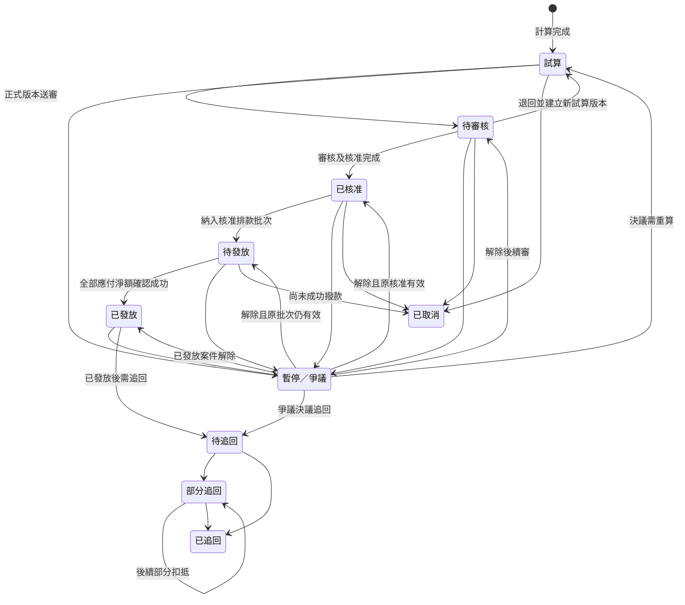
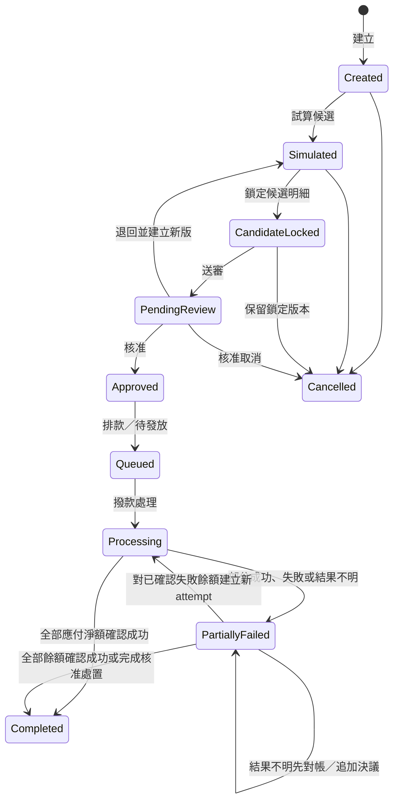

# Task 04A-3B：獎金狀態機、防重、結算批次與稽核規格

## 1. 文件目的與邊界

### 1.1 文件資訊

| 項目 | 內容 |
|---|---|
| 文件狀態 | 規格草案，待審核 |
| 文件版本 | v1.0-draft |
| 建立日期 | 2026-06-27 |
| 上游依據 | `docs/task-04a-1-bonus-policy-spec.md`、`docs/task-04a-2-sheet-gap-analysis.md`、`docs/task-04a-3a-bonus-data-model-foundation.md` |
| 適用範圍 | 獎金生命週期、防重與重算、退款與追回、週結／月結、批次、撥款確認、權限、稽核及失敗復原 |

### 1.2 本文件定義

- 顧問可見獎金狀態與內部多維狀態的安全映射。
- 正常生命週期、暫停／爭議、取消及追回流程。
- 成交型與期間彙總型獎金的防重、重跑、重算及正式版本採用。
- 週結、月結、不可變批次明細及人工撥款確認。
- 系統、營運、審核、核准、財務、稽核、顧問與導師的權限邊界。
- 稽核事件目錄、異常阻擋、重試及復原原則。

### 1.3 邊界

- 本文件是邏輯流程規格，不建立正式 Sheet、欄位、下拉值、Apps Script、API 或前端畫面。
- 不實作自動計獎、自動核准、銀行串接或自動撥款。
- 不新增或修改 Task 04A-1 已確認的獎金金額、門檻、期間或營運規則。
- 不自行補定法律、稅務、扣繳、手續費或退匯作業。
- 不修正 HC9001 的 90 天推薦保護正式 Web App 寫入異常。
- 正式雜湊演算法、資料庫約束及實體欄位留待後續實作設計。

## 2. 獎金狀態模型

### 2.1 顧問可見狀態保持不變

正常五階段：

```text
試算 → 待審核 → 已核准 → 待發放 → 已發放
```

例外狀態：

```text
暫停／爭議、已取消、待追回、部分追回、已追回
```

以上顯示名稱已由 Task 04A-1 確認，不得改名或合併。內部可以使用多個狀態維度，但顧問大廳必須依本規格映射為上述名稱。

### 2.2 內部多維狀態

單一文字欄容易產生「已發放但又被改成取消」或「爭議解除後不知道原狀態」等不可能組合。技術設計建議至少分成四個維度：

| 維度 | 建議內部值 | 用途 |
|---|---|---|
| 計算／審核 `calculation_review_status` | `CALCULATED`、`PENDING_REVIEW`、`RETURNED`、`APPROVED`、`CANCELLED` | 表達計算版本是否正式送審、退回、核准或於發放前取消 |
| 撥款 `payout_status` | `NOT_SCHEDULED`、`QUEUED`、`PROCESSING`、`PARTIALLY_SUCCEEDED`、`FAILED`、`RESULT_UNKNOWN`、`PAID_CONFIRMED` | 由不可變 batch item 與追加式 payout attempt／result 紀錄推導的目前摘要；不得作為撥款歷史的唯一權威來源 |
| 暫停／爭議 `hold_dispute_status` | `NONE`、`ON_HOLD`、`DISPUTED`、`RESOLVED` | 暫停後續動作但保留原計算、審核及撥款事實 |
| 追回 `recovery_status` | `NONE`、`PENDING`、`PARTIAL`、`RECOVERED` | 已發放後獨立追蹤應追回、已追回及未追回餘額 |

必要一致性限制：

1. `CANCELLED` 只適用尚未實際發放的原獎金；`PAID` 後不得改為取消，須走追回。
2. `PAID_CONFIRMED` 只在應付淨額全部有確認成功的追加式 result、且沒有待確認餘額時成立；成功金額及安全憑證引用不可覆寫。
3. `ON_HOLD` 或 `DISPUTED` 會阻擋送審、核准、入批及撥款，但不抹除暫停前的狀態。
4. 只有 `APPROVED`、無有效暫停／爭議且符合批次條件的獎金可成為排款候選。
5. `PENDING`／`PARTIAL` recovery 可透過後續批次扣抵；不得把原獎金改回未發放。
6. settlement batch item 的財務核心在鎖定後不可變；撥款嘗試與結果只能追加新 attempt／result 紀錄。
7. 批次、bonus record 或 payout status 摘要若和不可變 batch item 及 attempt／result ledger 不一致，必須阻擋並轉人工處理。

### 2.3 顧問顯示狀態映射優先序

| 判定優先序 | 內部條件 | 顯示狀態 |
|---:|---|---|
| 1 | `recovery_status=RECOVERED` | 已追回 |
| 2 | `recovery_status=PARTIAL` | 部分追回 |
| 3 | `recovery_status=PENDING` | 待追回 |
| 4 | `hold_dispute_status` 為有效暫停或爭議 | 暫停／爭議 |
| 5 | `calculation_review_status=CANCELLED` 且未發放 | 已取消 |
| 6 | `payout_status=PAID_CONFIRMED`，且確認成功累計金額等於應付淨額、沒有未成功或結果不明餘額 | 已發放 |
| 7 | 已核准且已進入核准排款明細，但尚有未成功、失敗、處理中或結果不明金額 | 待發放 |
| 8 | `calculation_review_status=APPROVED` | 已核准 |
| 9 | `calculation_review_status=PENDING_REVIEW` | 待審核 |
| 10 | 其他有效計算版本 | 試算 |

映射只是顯示層；例如已發放後進入爭議時，底層已確認成功的 attempt／result 事實必須保留。爭議決議後，依結果恢復顯示已發放或進入追回，不得重新發放。部分成功但仍有餘額時，顧問主狀態維持待發放，電子明細可以顯示「已成功金額」與「待處理餘額」，但不得新增新的顧問狀態名稱。結果不明者同樣維持待發放或僅加內部異常標記，完成財務對帳前不得顯示已發放。

### 2.4 顯示狀態定義

| 顯示狀態 | 進入條件與允許來源 | 允許下一狀態 | 操作角色 | 必要欄位／佐證 | 可修改試算 | 可納入批次 | 可發放 | 稽核事件 | 終止狀態 |
|---|---|---|---|---|---|---|---|---|---|
| 試算 | 有效 calculation run 完成；來源為尚未計算、退回重算或合法新版本 | 待審核、暫停／爭議、已取消 | 系統建立；營運可發起重算或送審 | run ID、idempotency key、計算版本、來源快照、規則版本、完整性結果 | 不直接覆寫；可建立新版本 | 否 | 否 | 必須 | 否 |
| 待審核 | 正式採用一個試算版本並送審；來源為試算或爭議解除後重新送審 | 試算、已核准、暫停／爭議、已取消 | 營運送審；審核者審查／退回 | 正式採用版本、送審人／時間、計算依據、例外檢查 | 否；退回後建立新試算版本 | 否 | 否 | 必須 | 否 |
| 已核准 | 審核與核准步驟完成；來源為待審核 | 待發放、暫停／爭議、已取消 | 審核者提出通過；核准者核准 | 審核及核准結果、角色、時間、差異、必要佐證 | 否 | 可成為批次候選 | 否 | 必須 | 否 |
| 待發放 | 已核准且納入核准的不可變批次明細；或雖有部分成功但仍存在未成功／結果不明餘額 | 已發放、暫停／爭議、已取消；失敗、部分成功或結果不明時維持待發放 | 批次程序排款；財務以追加式 attempt／result 處理 | batch/item ID、財務核心、attempt ID、累計確認成功、待處理餘額及異常摘要 | 否 | 已納入且鎖定 | 只可對尚未成功且結果明確的餘額建立新 attempt | 必須 | 否 |
| 已發放 | 應付淨額全部由追加式 result 確認成功，且無處理中、失敗待重試或結果不明餘額；來源為待發放 | 待追回或暫停／爭議 | 財務確認結果；狀態由 ledger 推導 | 全部 attempts／results、成功總額、時間、batch item、對帳結果及安全憑證引用 | 否 | 不重複納入原應付款；後續調整可另批 | 已完成，不得再送同一成功金額 | 必須 | 原撥款生命週期是；仍可衍生追回 |
| 暫停／爭議 | 資料缺漏、保護期不明、歸屬／資格／組織爭議、重大違規或人工暫停；可覆蓋任何未結案階段及已發放後爭議 | 回到暫停前有效狀態、已取消、待追回 | 營運可提報；審核／核准者依權限解除或決議 | 原狀態、原因代碼、爭議類型、責任人、佐證、決議與時間 | 否；需重算時另建版本 | 否 | 否 | 必須 | 否 |
| 已取消 | 發放前確認不成立或退款／取消後歸零；來源為試算、待審核、已核准或尚未成功的待發放 | 原紀錄不再前進；新資格成立時另建關聯計算／差額 | 營運提案，審核／核准者依階段確認 | 取消原因、原狀態、退款／訂單事件、決議、關聯新版本 | 否 | 否；已鎖批次須以新版／新批次排除 | 否 | 必須 | 是，原紀錄終止 |
| 待追回 | 已發放後發生退款、取消、違規決議或多發；來源為已發放或爭議決議 | 部分追回、已追回、暫停／爭議 | 營運建立；審核／核准者確認；財務執行扣抵／收回 | 原 bonus、原因、應追回金額、退款／決議、未追回餘額 | 否 | 可作後續批次扣抵項 | 不可作正向發放；可扣抵 | 必須 | 否 |
| 部分追回 | 已追回金額大於零且小於應追回；來源為待追回 | 部分追回、已追回、暫停／爭議 | 財務確認，管理端覆核 | 每次追回／扣抵批次、已追回、未追回、時間與憑證 | 否 | 剩餘額可續入後續扣抵批次 | 否 | 必須 | 否 |
| 已追回 | 已追回金額等於應追回；來源為待追回或部分追回 | 原則不再變更；更正須新事件及人工審核 | 財務確認，核准者依流程覆核 | 完整追回明細、餘額為零、對帳及安全憑證引用 | 否 | 否 | 否 | 必須 | 是 |

### 2.5 精簡狀態圖



## 3. 角色與操作權限

### 3.1 角色矩陣

| 角色 | 可執行 | 不可執行 | 必留稽核 |
|---|---|---|---|
| 系統計算程序 | 驗證資料、建立試算、calculation run／snapshot、basis items、防重檢查、候選批次試算 | 自行送出人工核准、核准獎金、確認撥款、解除爭議 | run ID、規則版本、輸入摘要、結果、錯誤與鎖定結果 |
| 管理者／營運人員 | 建立案件、發起計算／重算、採用試算版本、送審、提報暫停／爭議、提出調整與取消 | 自動視為審核／核准完成、確認銀行已撥款 | 操作角色、原因、來源、版本、時間與佐證 |
| 審核者 | 核對歸屬、資格、件數、金額、規則版本、退款與例外；通過或退回 | 修改原始試算、代表財務確認撥款 | 審核結果、差異、退回原因、時間與安全識別 |
| 核准者 | 核准獎金、調整、追回及批次；拒絕或退回 | 直接覆寫計算證據、直接標記撥款成功 | 核准範圍、版本、結果、時間與佐證 |
| 財務 | 建立／確認排款、追加 attempt／result／更正決議、對帳、確認追回與扣抵 | 修改 batch item 財務核心、既有 attempt／result、獎金資格、規則、原始試算或自行核准 | 批次／item、attempt／result、金額、時間、失敗代碼及安全憑證引用 |
| 稽核或唯讀角色 | 依授權查詢不可變歷史、版本、事件及對帳結果 | 修改任何業務資料或查看未授權完整個資 | 查詢範圍、用途、時間及匯出事件 |
| 顧問 | 查本人業績、獎金與必要遮罩會員資料 | 審核、核准、查看他人收入或金融資料 | 敏感查詢依政策記錄 |
| 有效導師 | 查授權團隊的必要件數與組織獎相關資訊 | 查看無關下層完整收入、完整會員個資或執行管理操作 | 查詢範圍、導師資格與時間 |

### 3.2 職責分離

1. 系統只負責試算與控制，不自行核准或確認撥款。
2. 財務只在取得核准批次及實際結果後確認撥款。
3. 即使初期由同一自然人兼任營運、審核、核准或財務，仍須使用分開的操作步驟、角色標記、時間及 audit event，不得一鍵跳過。
4. 是否強制審核者與核准者為不同自然人尚未確認。本規格建議高額、例外、人工調整及追回採職責分離，但不得在營運決策前寫死。
5. 角色權限採最小授權；權限異動須即時生效並留下事件。

## 4. 狀態轉換規則

| 情境 | 前置狀態 | 動作與結果 | 阻擋條件 | 角色與稽核 |
|---|---|---|---|---|
| 試算送審 | 試算 | 鎖定正式採用 calculation version，建立正式 bonus record 或送審版本，顯示待審核 | 快照不完整、規則重疊、有效暫停／爭議 | 營運送審；記錄採用版本及 run ID |
| 審核退回重新試算 | 待審核 | 原送審版本保留為退回；新 calculation run 建立新版本，顯示試算 | 不得直接編輯原版本 | 審核者填退回原因；系統建立新 run |
| 審核通過 | 待審核 | 記錄審核通過，等待核准步驟；對外仍不得提前顯示已核准 | 例外未清、佐證缺失 | 審核者；保存檢查結果 |
| 核准 | 待審核且審核通過 | calculation/review 狀態成為 APPROVED，顯示已核准 | 系統不得代核准；有效爭議、版本變動、資料指紋不同 | 核准者；保存核准版本、時間與差異 |
| 納入待發放批次 | 已核准 | 建立不可變 batch item；批次核准排款後顯示待發放 | 重複納入、追回抵扣未算、已暫停、批次鎖衝突 | 系統試算、批次審核／核准；均留事件 |
| 實際撥款全部成功 | 待發放 | batch item 不變；追加成功 result。只有累計確認成功等於應付淨額且無未知餘額時顯示已發放 | 結果不明、金額或受益人不一致、audit 無法寫入 | 財務；記錄 attempt／result、安全憑證引用及對帳結果 |
| 撥款失敗 | 待發放 | batch item 不變；追加失敗 result，主狀態維持待發放；查明後以新的 retry attempt 處理未成功金額 | 結果不明時禁止重送；不得修改或重新啟用原 attempt | 財務；失敗代碼、時間、parent／retry attempt 關聯 |
| 撥款部分成功 | 待發放 | batch item 不變；追加成功／失敗金額 result，主狀態維持待發放，明細顯示成功金額與待處理餘額 | 禁止整筆或整批重送，成功部分不得再送 | 財務；逐 attempt／result 與推導摘要 |
| 撥款結果不明 | 待發放 | batch item 不變；追加結果不明 result，維持待發放並加內部異常標記 | 完成對帳或人工決議前禁止重試及顯示已發放 | 財務；attempt、未知原因、對帳／決議引用 |
| 更正錯誤的人工撥款結果 | 待發放或已發放摘要 | 不修改原 result；新增更正／決議事件，重新推導狀態與餘額 | 缺少原因、覆核或對帳佐證時阻擋 | 財務提出，授權角色覆核；關聯原 result 及安全佐證 |
| 發放前取消 | 試算／待審核／已核准／尚未成功的待發放 | 原紀錄顯示已取消；已鎖批次以新版或取消 item 處理 | 任一成功撥款則不得取消成功部分 | 依階段由營運提案、審核／核准；留原因及來源事件 |
| 爭議暫停 | 任一狀態 | 設定 hold/dispute，保留暫停前所有維度，停止後續動作 | 無原因、責任人或佐證不得建立人工暫停 | 營運提報，審核／核准決議；完整事件 |
| 爭議解除 | 暫停／爭議 | 回到暫停前有效狀態，或因資料改變建立新試算、取消／追回 | 不得任意指定較後階段 | 授權決議者；保存前後狀態及決議 |
| 試算／審核階段退款 | 試算／待審核 | 原版本保留；建立退款事件及新試算；不成立者取消 | 禁止覆寫原始試算 | 系統重算、營運送審、審核確認 |
| 核准後退款 | 已核准 | 建立新計算與差額；原獎金取消或建立發放前調整，重新審核 | 原核准不得直接改金額 | 營運、審核、核准；保留原核准 |
| 待發放退款 | 待發放 | batch item 財務核心不變；尚未嘗試部分另以核准調整處理，成功或結果不明部分先依 attempts 對帳 | 結果不明禁止重送或直接取消；不得改原 item／result | 財務與營運協作；記錄競態、調整及決議 |
| 已發放後退款 | 已發放 | 原發放保留；建立負項追回，顯示待追回 | 禁止改回未發放或已取消 | 營運建立、審核／核准、財務追回 |
| 部分追回 | 待追回／部分追回 | 更新衍生餘額並新增不可變追回／扣抵 item，顯示部分追回 | 禁止覆寫前次追回 item | 財務確認，核准／稽核依流程覆核 |
| 完全追回 | 待追回／部分追回 | 已追回等於應追回、未追回為零，顯示已追回 | 金額不平或結果不明 | 財務確認；保存對帳與安全憑證引用 |
| 後續批次扣抵 | 待追回／部分追回 | 建立新的負向 batch item；只扣抵尚未追回餘額 | 不得超扣、重複扣或修改原批次 | 系統試算、批次審核／核准、財務確認 |

已核准、已發放及追回紀錄禁止刪除或直接覆寫。任何更正均以新計算版本、調整、追回、反向事件或新批次明細表達。

## 5. 防重、重跑與併發控制

### 5.1 計算執行識別

| 概念 | 定義 |
|---|---|
| `calculation_run_id` | 每次實際計算執行的唯一識別；成功、失敗、重試都各有 run，並以 parent／retry run 關聯 |
| `idempotency_key` | 對同一業務輸入、計算範圍及規則版本產生的穩定鍵；相同請求重試應命中相同結果而非新增獎金 |
| `calculation_version` | 同一業務計算範圍的遞增版本；輸入或合法規則改變才建立新版本 |
| `adopted_calculation_version` | 經營運送審所採用、之後可被審核與核准的唯一版本；歷史採用關係不可刪除 |
| `input_fingerprint` | 對已正規化、已遮蔽的計算來源與版本建立的安全摘要；不得包含可逆個資或憑證 |

### 5.2 成交型獎金防重範圍

```text
deal_snapshot_id
+ bonus_type
+ beneficiary_consultant_id
+ applicable_rule_version
+ recognition_period_or_NOT_APPLICABLE
```

基本推廣、導師自推、指導及培育等成交型獎金，在相同防重範圍內只能有一個有效正式結果。合法重算建立版本或調整關聯，不建立第二筆無關聯同義獎金。

### 5.3 期間彙總型獎金防重範圍

業務計算範圍：

```text
bonus_type
+ beneficiary_consultant_id
+ recognition_period
+ bonus_rule_version_id
+ campaign_period_or_version_or_NOT_APPLICABLE
```

計算快照識別再加入 `calculation_version` 或 `bonus_calculation_snapshot_id`。同一業務範圍可因退款或重算保留多個歷史版本，但同一時點只能有一個正式採用版本及一個有效正式 bonus result。

### 5.4 Basis item 防重

同一 calculation snapshot 中，以下概念組合須唯一：

```text
bonus_calculation_snapshot_id
+ source_entity_type
+ source_entity_id
```

同一來源不得重複納入。納入、扣除或排除應由 effect type 與原因表達，不複製來源列來產生第二次影響。若一個來源依法需要多種效果，實體設計必須先定義可驗證的子項識別，不得繞過防重。

### 5.5 重跑與重算

| 類型 | 觸發 | 結果 |
|---|---|---|
| 重試 `retry` | 技術錯誤、逾時，業務輸入與版本完全相同 | 使用相同 idempotency key；不得新增第二筆獎金或 basis item |
| 重跑 `rerun` | 人工或排程再次執行相同範圍，輸入未變 | 產生新 run 紀錄，但命中同一業務結果；不得自動增加 calculation version |
| 重算 `recalculate` | 退款、調整、資料合法更正或核准的新規則適用 | 建立新 calculation version、snapshot 與 basis items；原版本保留 |

重算後的新版本不會自動取代已送審、核准或發放版本。正式採用、差額、取消及追回仍須依狀態與人工流程處理。

### 5.6 鎖定與版本重疊

1. 計算鎖的概念範圍為獎金類型、受益顧問、認列期間及規則／活動版本；成交型另含 deal snapshot。
2. 批次鎖的概念範圍為批次類型、認列期間、批次版本及候選 item 集合。
3. 同一鎖定範圍同時只能有一個持有者；取得失敗者不得繼續寫入，應安全結束或稍後重試。
4. 鎖必須有 owner run ID、取得時間、到期／租約及安全釋放機制；不得因程序中斷永久鎖死。
5. 規則生效期間重疊、找不到唯一版本或版本未核准時，停止自動計算並轉人工處理，不得選最新更新版本猜測。
6. 失敗重試先查既有 idempotency result、bonus record、snapshot 及 batch item，再決定是否續作。
7. 不適用欄位使用版本化的固定標準值，例如 `NOT_APPLICABLE`；不得混用空字串、null、零或自由文字。正式標準值表及雜湊演算法留待實作設計。

## 6. 退款、重算與追回

### 6.1 發放前退款

1. 建立不可變 refund／adjustment 事件，連結原訂單、付款、deal snapshot 及受影響獎金。
2. 依退款後最終方案、人數、有效件數及規則版本建立新 calculation version；不覆蓋原試算。
3. 尚未送審者保留原試算並產生新試算；已送審或核准者須退回人工審核。
4. 新結果為零或不再成立時，依權限將原獎金標記已取消；有差額時建立關聯調整及重新核准。
5. 已納入但尚未成功撥款的 batch item 必須先鎖住，透過批次新版、取消 item 或新批次修正，不直接刪除。

### 6.2 發放後退款

1. 原 bonus record、已發放狀態、批次明細及撥款結果永久保留。
2. 建立 `bonus_adjustment_or_recovery` 負項紀錄，保存應追回金額、原獎金、退款事件及規則版本。
3. 優先由下一期已核准可發放獎金扣抵；實際扣抵仍須經批次審核與核准。
4. 每次扣抵或收回分開保存，持續計算：

```text
未追回餘額 = 應追回金額 - 累計已追回金額
```

5. 累計已追回大於零但小於應追回時顯示部分追回；餘額為零才顯示已追回。
6. 不足部分保留待追回款，不得自行減免；放棄、調整或其他處理須有正式營運／法律決議。

### 6.3 期間活動回溯

退款或調整影響原認列月份時：

1. 以原月份、原制度／活動版本建立新的 bonus calculation snapshot/version。
2. 頂尖獵人重新建立完整 basis items、總件數與當月級距判定。
3. 組織經營獎重新建立團隊成交清單、排除項、團隊件數、門檻、活動獎扣除明細及擇優結果。
4. 原 calculation snapshot、basis items、正式採用版本、bonus record 及發放紀錄不覆寫。
5. 新舊結果差額在發放前走取消／調整，在發放後走負項追回；不得直接把原月結金額改成新值。
6. 回溯可能連鎖影響團隊成員頂尖獵人及導師組織獎，須以 correlation ID 串聯所有重算與人工審核。

## 7. 週結與月結批次

### 7.1 已確認分類與預定撥款

| 批次類型 | 獎金項目 | 已確認撥款規則 |
|---|---|---|
| 週結基本類 | 基本推廣獎金、導師自推加碼、指導獎、培育獎 | 預定於交易週結束後第二個週五撥款 |
| 月結類 | 頂尖獵人獎、組織經營獎 | 預定於次月第二個週五撥款 |

共同規則：遇非營業日順延至下一營業日；尚未通過適用退費期間、人工審核或爭議檢查者順延下一批次；順延不得造成重複發放。

Task 04A-1 第 13.2 節「週結獎金」已明確規定成交週採台灣時間週一至週日，因此本文件保留該已確認範圍。精確起訖 timestamp、截單時間、延遲入帳／補登歸期及國定假日／營業日資料來源仍待決策，本文件不自行補定。

### 7.2 批次生命週期



### 7.3 各階段控制

| 批次階段 | 主要角色 | 可否修改 | 鎖定內容 | 稽核要求 |
|---|---|---|---|---|
| 建立 | 系統或營運 | 可修改批次參數；不可改獎金事實 | batch ID、類型、認列期、版本、建立者 | 建立原因、參數、時間、correlation ID |
| 試算 | 系統 | 可重跑；同輸入須冪等 | 候選查詢條件、規則版本、預估應付／扣抵 | run ID、候選與排除統計、錯誤 |
| 鎖定候選明細 | 系統 | 原鎖定版本不可改；變更建新版 | item ID、來源、受益顧問、金額、狀態、版本指紋 | 鎖 owner、時間、每筆納入／排除原因 |
| 待審核 | 審核者 | 不可直接改 item；退回試算建立新版 | 全部 batch items、總額、扣抵、版本及差異 | 送審、審核、退回原因與安全差異 |
| 已核准 | 核准者 | 不可修改；變更須取消／新批次 | 核准 batch version 與完整 items | 核准者、時間、總額、版本指紋 |
| 排款／待發放 | 財務 | batch item 財務核心不可改；可新增排款準備事件 | 每筆不可變 item、淨額、受益顧問、安全付款目的 | 排款人、排款時間、輸出／查詢事件 |
| 撥款處理 | 財務 | 只能追加 payout attempt 及 result，不得修改 batch item 或既有 attempt／result | attempt idempotency、嘗試金額、parent／retry 關聯 | 每次嘗試、結果、失敗代碼、安全憑證引用 |
| 完成 | 財務確認；稽核唯讀 | 不可修改；摘要由 ledger 推導 | 所有 item 的應付淨額均由追加式 results 確認成功、無未知餘額 | 完成、對帳事件及總額核對 |
| 部分失敗 | 財務與營運 | 成功事實不可改；已確認失敗餘額用新 attempt；未知結果只能先對帳 | 成功集合、失敗集合、未知集合、待處理餘額及全部 attempts | 每筆 result、更正／決議、重試與對帳關聯 |
| 已取消 | 依階段由授權角色 | 不可恢復原版本；要重做建新批次 | 取消前版本、已確認成功 result（如有則成功事實不可取消） | 原因、角色、時間、影響範圍 |

批次「待審核／已核准」是批次層級控制，不取代單筆 bonus record 的人工審核與核准。只有已核准的獎金或已核准的調整／追回，才能成為批次候選。

## 8. 不可變批次明細

### 8.1 Settlement batch item 邏輯能力

每次批次納入以不可變 batch item 保存。候選內容鎖定後，其財務核心即不可修改，至少包含：

| 欄位群組 | 必要內容 |
|---|---|
| 識別 | settlement_batch_item_id、batch ID、batch version、item version、鎖定時間、內容指紋 |
| 來源 | bonus record ID 或 adjustment／recovery ID、來源類型、原始獎金ID |
| 受益人 | beneficiary consultant ID；不在一般記錄輸出姓名或金融資料 |
| 金額 | 幣別、應付金額、扣抵金額及淨額；不得只存不明來源的淨額 |
| 納入 | 納入類型（正向應付、負向扣抵、追回、調整）、納入時狀態、認列期間 |
| 版本 | deal／calculation snapshot、計算版本、規則版本、活動版本、正式採用版本及批次版本 |

batch item 不保存可被後續覆寫的撥款成功／失敗狀態、成功金額、失敗原因或憑證。這些結果一律由追加式 payout attempt／result ledger 保存；batch item 只回答「本批次核准要處理什麼及多少」。

### 8.2 Payout attempt／result 邏輯能力

每次實際撥款處理都必須建立新的 attempt。為同時滿足「發起時即有識別」及「結果不可覆寫」，邏輯上分為不可變 attempt command 與追加式 result／decision event；查詢時可以組合成同一撥款歷程，但不得以一筆可更新資料取代 ledger。

| 紀錄 | 必要內容 |
|---|---|
| `payout_attempt` | attempt ID、settlement batch item ID、idempotency key、嘗試金額、發起時間、財務操作角色安全識別、parent／retry attempt ID、correlation ID |
| `payout_result` | result ID、attempt ID、成功／失敗／結果不明、成功金額、失敗金額、失敗原因代碼、結果時間、安全憑證引用、對帳或人工決議引用 |
| `payout_result_correction_or_decision` | correction／decision ID、原 result ID、原因、正確判定或待確認結論、提出與覆核角色、時間、對帳佐證安全引用 |

若現階段實體實作採單一 append-only event 結構，也必須保留上述語意與欄位，並以事件類型區分 attempt、result 及 correction／decision。不得先建立一筆 attempt 再原地改寫結果。

### 8.3 推導摘要

撥款結果摘要可由 batch item 財務核心及其全部追加式 attempts／results 推導，以加速顧問大廳或管理端查詢；摘要不是唯一權威來源，且必須可重建：

```text
確認成功累計 = 所有有效成功 result 的成功金額合計
待處理餘額 = batch item 淨額 - 確認成功累計
```

- `待處理餘額 > 0` 時，顧問主狀態維持待發放。
- 存在結果不明 attempt 時，維持待發放並加內部異常標記；對帳完成前不得重試。
- 只有待處理餘額為零、全部淨額均確認成功且無結果不明時，才推導 `PAID_CONFIRMED` 及顯示已發放。
- 更正錯誤人工結果時，新增 correction／decision event 後重新推導；原 result 永久保留。

### 8.4 不可變與重試規則

1. batch item 財務核心在候選鎖定後不得原地修改；送審或核准後更不得覆寫。
2. 候選變更須建立 batch version；核准後變更須建立新批次或經核准的反向／調整 item。
3. 同一原始獎金的正向發放、後續調整、追回或跨期扣抵可以分屬不同批次，並以來源關聯形成完整鏈。
4. 同一來源及納入類型在同一 batch version 不得重複；跨批次納入前須檢查既有成功、處理中及未知結果。
5. 每次重試必須建立新的 attempt，並關聯 parent／retry attempt ID；不得修改、重新啟用或覆寫原 attempt／result。
6. 撥款部分成功時，成功金額永久保留；新 attempt 的嘗試金額不得超過已確認失敗且尚未成功的餘額。
7. 結果不明不是失敗，完成對帳或追加人工決議前不得建立 retry attempt。
8. 錯誤的人工撥款結果以 correction／decision event 更正，不直接修改原 result。
9. 正式 batch item、payout attempt／result 的實體欄位、版本鍵、資料庫約束及是否獨立分頁，留待後續實作設計。

## 9. 批次與撥款控制

### 9.1 批次鎖定與重複納入

- 同一批次類型與認列期間只能有一個進行中的核准版本；若業務允許多批，必須有互斥的 item 範圍及明確批次序號。
- 鎖定時逐筆檢查 bonus／adjustment／recovery 是否已存在於其他待處理 item，並查閱相關 attempts／results 是否已有處理中、成功或結果不明金額。
- 已成功正向發放的原始獎金不得再次作正向應付；合法差額須使用 adjustment 或 recovery ID。
- 鎖衝突不等待盲目寫入；安全停止、記錄 owner run ID，待鎖釋放後重新查驗。

### 9.2 待追回餘額扣抵

1. 先取得經審核／核准的未追回餘額快照。
2. 扣抵 item 分別保存原正向獎金、recovery ID、可扣抵上限、本次扣抵及剩餘餘額。
3. 同一餘額同時只能由一個批次鎖定，避免兩批超扣。
4. 扣抵後淨應付不得由系統自行套用未確認的稅務、手續費或其他扣款。
5. 部分扣抵後維持部分追回；餘額為零才成為已追回。

### 9.3 部分成功、失敗與未知結果

- batch item 財務核心不記錄撥款結果；每次 attempt 與 result 以追加式 ledger 個別保存，批次及顧問顯示摘要由 ledger 推導。
- 全部 batch item 淨額均確認成功才可直接完成；任一 item 尚有未成功或結果不明餘額，批次進入部分失敗／待處理。
- 已確認失敗的餘額可在查明原因後建立新的 retry attempt；原 attempt 及 result 不變。
- 結果不明不是失敗；在完成對帳或新增人工決議前禁止重試，以免重複匯款。
- 部分成功時，顧問主狀態維持待發放；電子明細可顯示確認成功累計與待處理餘額。
- 人工取消不得取消已成功事實；只能對尚未成功部分建立核准調整、新批次或後續追回。

### 9.4 撥款與對帳

- 本階段不假設銀行 API。系統須支援財務逐筆或批次匯入／人工確認，並將每次操作追加為 payout attempt、result 或 correction／decision event，保留角色、時間、batch item 關聯及安全憑證引用。
- 撥款憑證存於受控位置；一般記錄及顧問端不得出現完整帳號、金融資料、公開 URL 或憑證內容。
- 財務確認成功不等於批次已對帳；對帳與人工決議以追加事件保存，不修改原 result。
- 單一 attempt 或部分金額成功不代表整筆獎金已發放。只有 batch item 淨額全部確認成功且無未知餘額，顧問主狀態才顯示已發放。
- 失敗、部分成功或未知時主狀態維持待發放；電子明細可顯示已成功金額及待處理餘額，不新增顧問顯示狀態。
- 重試及復原沿用原 correlation ID 鏈，但每次均建立新的 attempt ID 及 parent／retry 關聯，確保不遺漏且不重送成功部分。

## 10. 稽核事件

### 10.1 Audit event 最小內容

| 欄位群組 | 內容 |
|---|---|
| 識別 | event ID、event type、correlation ID、calculation／batch／attempt run ID |
| 目標 | target entity type、target ID、必要的父實體ID |
| 變更 | 前後狀態、版本或已遮蔽的安全差異；不可複製完整敏感值 |
| 操作人 | 操作者角色、安全識別；系統程序需記錄 service identity |
| 覆核 | 覆核者角色與安全識別、覆核結果及時間；不適用時使用標準值 |
| 原因 | reason code、必要備註、爭議／錯誤分類 |
| 佐證 | 受控、安全且需授權的 evidence reference；不得記錄公開 URL 或憑證內容 |
| 時間 | 發生時間、記錄時間、時區；週月結採 `Asia/Taipei` |
| 結果 | 成功、失敗、部分成功、阻擋或結果不明，以及安全錯誤代碼 |

### 10.2 事件目錄

| 類別 | 必要事件 |
|---|---|
| 計算 | 試算建立、重試、重跑、重算成功／失敗、正式 calculation version 採用、採用撤回／取代 |
| 審核核准 | 送審、審核通過、退回、核准、拒絕、發放前取消 |
| 暫停爭議 | 暫停建立、爭議建立、責任人指派、解除、決議取消、決議追回 |
| 批次 | 建立、試算、候選鎖定成功／失敗、送審、退回、新版、核准、取消、完成、部分失敗 |
| 撥款 | attempt 建立、result 成功／失敗／未知、新 retry attempt、錯誤結果更正／決議、人工確認、對帳完成／差異；所有事件均關聯 batch item 及 parent attempt |
| 退款追回 | 退款事件、發放前差額、負項追回、部分追回、跨期扣抵、完全追回、未追回餘額變化 |
| 規則版本 | 草稿建立、核准、生效、停用、重疊阻擋及新版本取代 |
| 人工調整 | 調整提出、審核、核准、退回、執行及取消；保存前後安全差異 |
| 敏感存取 | 個資／金融／獎金查詢、匯出、顧問大廳敏感查詢及被拒絕的越權嘗試 |
| 權限 | 角色授予、移除、資格暫停造成的即時停權、登入／驗證策略變更 |

### 10.3 記錄安全

一般執行記錄與 audit event 不得寫入完整姓名、手機、Email、地址、LINE UID、身分證、銀行帳戶、付款明細、健康資料、Spreadsheet ID、Web App／憑證 URL、Script Properties 或其他憑證。

稽核事件使用穩定內部ID、原因代碼、遮罩摘要或不可逆安全摘要。敏感佐證只保存受控引用，且查閱佐證本身也須產生 audit event。

## 11. 異常與復原矩陣

| 異常 | 是否阻擋 | 可否重試 | 人工處理 | 不得發生的副作用 | 必留稽核 |
|---|---|---|---|---|---|
| 同一計算被重複執行 | 相同鍵的第二次寫入須阻擋或命中既有結果 | 可，以同 idempotency key | 只有結果不一致時需要 | 重複 bonus、snapshot、basis item | run、key、命中結果、輸入指紋 |
| 同時啟動兩個相同期間批次 | 後取得鎖者阻擋 | 鎖釋放後重新查驗可重試 | 鎖逾時或範圍衝突時需要 | 重複鎖定、重複排款 | 兩個 run、lock owner、範圍與結果 |
| 規則版本重疊 | 阻擋自動計算及送審 | 規則修正後可 | 必須，由規則管理者決議 | 猜測版本或選最新修改版 | 候選版本、期間、阻擋原因及決議 |
| 快照資料不完整 | 阻擋正式採用、送審及入批 | 資料補正後建立新 run | 必要時 | 建立可核准的不完整獎金 | 缺項清單、安全來源及補正事件 |
| 90 天推薦保護資料缺失 | 阻擋相關獎金自動成立 | 正式問題修正且驗證後可 | 必須 | 以目前 lead 顧問猜測歸屬 | lead／deal 安全ID、缺失類型、人工決議 |
| 顧問資格或組織快照缺失 | 阻擋導師及組織相關獎金 | 補正並新建快照／計算版本後可 | 必須 | 使用目前組織回填歷史 | 缺失節點、認列時間、補正與核准 |
| 批次核准後資料遭變更 | 阻擋撥款或受影響 item | 建立新批次／版本後可 | 必須 | 原核准 batch item 被覆寫 | 版本指紋差異、偵測時間、處置 |
| 撥款部分成功 | 阻擋該獎金顯示已發放及整批標完成 | 只對已確認失敗且尚未成功餘額建立新 attempt | 財務必須對帳 | 修改 batch item／原 result、重送成功金額、整批回滾 | 原 attempt／result、新 retry attempt、成功額、待處理餘額 |
| 撥款結果不明 | 阻擋重試、顯示已發放與批次完成 | 對帳或追加人工決議後才可 | 財務必須 | 把未知當失敗重送、當成功顯示或修改原 result | attempt、未知 result、原因、查證與 correction／decision |
| 退款與撥款同時發生 | 鎖住未處理 item；結果未知部分阻擋 | 對帳及退款快照完成後可 | 財務與營運共同處理 | 同時取消又撥款、漏建追回 | refund、batch、item、時間序列與決議 |
| 人工調整缺少原因或覆核 | 阻擋送審／核准／入批 | 補齊後可 | 必須 | 無依據改變金額或件數 | 缺欄位、提出者、補正與覆核 |
| 錯誤的人工撥款結果 | 阻擋依錯誤摘要繼續發放、追回或結案 | 新增更正／決議事件後可重新推導 | 財務提出且授權角色覆核 | 修改或刪除原 result、遺失原錯誤事實 | 原 result、correction／decision、原因、覆核及對帳引用 |
| 稽核事件寫入失敗 | 對尚未提交的狀態變更採失敗關閉並阻擋 | 稽核可用後以同 idempotency key 重試 | 外部事實已發生時必須人工復原 | 業務狀態成功但無稽核、修改原 attempt／result、重複撥款 | 安全錯誤碼、correlation／attempt ID；不得在一般記錄洩密 |

若撥款等外部事實已經發生而 audit 寫入失敗，不得盲目回滾外部事實或再次撥款。系統應凍結該 item，保留既有 attempt／result，使用 correlation／attempt ID 進行人工對帳，追加受控復原或決議事件後才繼續。

## 12. 驗收案例

| 編號 | 案例 | 預期結果 |
|---:|---|---|
| 1 | 同一訂單分次付款，尚未全額入帳 | 不成立可送審獎金或有效件數；payment 歷史保留 |
| 2 | 最後一筆款項確認入帳 | 建立 deal snapshot 及一次成交型試算；使用完整方案、人數及規則版本 |
| 3 | 同一成交以相同輸入重跑三次 | run 可有三筆，idempotency key 命中同一業務結果，只存在一筆有效正式獎金 |
| 4 | 同一月份頂尖獵人月結重跑 | 不重複建立正式獎金；calculation snapshot 與 basis 防重有效 |
| 5 | 月結後退款造成頂尖獵人件數下降 | 建立新 calculation version，重新判定當月級距；原快照與原獎金不覆寫 |
| 6 | 組織經營獎受團隊退款影響 | 新版本重算團隊件數、活動獎扣除及條件擇優；差額走取消或追回 |
| 7 | 發放前部分退款 | 依最終方案／人數重算；原試算及核准保留，差額重新審核，不直接改原金額 |
| 8 | 發放後部分退款 | 原已發放不變；建立負項追回並顯示待追回 |
| 9 | 下一期有可發獎金可扣抵 | 建立負向不可變 batch item；只扣未追回餘額，扣後顯示部分追回或已追回 |
| 10 | 下一期獎金不足扣抵 | 成功扣抵部分保存，其餘保持未追回餘額，不自行減免 |
| 11 | 推薦歸屬爭議未解 | 顯示暫停／爭議，不進本期批次；解除後依原狀態或新版本進下一批，且不重複發放 |
| 12 | 顧問月中晉升導師 | 生效前後成交分別使用各自 deal／organization snapshot，不回寫舊成交 |
| 13 | 最近一層導師資格暫停 | 新成交依快照由再上一層最近有效導師承接既定項目；歷史成交不改派 |
| 14 | 同一筆獎金應付淨額僅部分成功 | batch item 不變；追加部分成功 result，主狀態維持待發放，明細顯示成功金額及待處理餘額；新 attempt 只處理確認失敗餘額 |
| 15 | 一筆撥款結果不明 | batch item 與原 attempt／result 不變；禁止重試或顯示已發放，待財務對帳並追加決議後續作 |
| 16 | 同一期間有兩個生效規則版本 | 自動計算阻擋，轉規則管理者人工處理，不任選版本 |
| 17 | 批次送審後來源金額被修改 | 版本指紋不符，阻擋核准／撥款；建立新批次版本並留事件 |
| 18 | 人工調整未填原因或覆核 | 阻擋送審及入批，不改原獎金 |
| 19 | 同一團隊成交同時出現在兩位導師月結 basis | 第二次納入遭阻擋；依 organization snapshot 保留唯一最近有效導師 |
| 20 | 一般顧問嘗試查詢其他顧問收入或完整會員資料 | 拒絕存取；不回傳敏感資料並建立安全 audit event |
| 21 | 同一人兼任審核、核准及財務 | 必須分三個操作步驟，分別保存角色與時間；不得一鍵跳過 |
| 22 | audit event 儲存暫時失敗 | 尚未提交的狀態轉換不生效；相同 key 安全重試，不產生重複獎金、batch item 或 attempt |
| 23 | 財務誤將失敗結果登記為成功 | 不修改原 result；新增更正／決議事件並覆核，重新推導待發放及待處理餘額 |
| 24 | 同一批次十筆中八筆全部成功、兩筆失敗 | 八筆在各自淨額全部成功後顯示已發放；兩筆維持待發放；批次部分失敗，只為失敗餘額建立新 attempts |
| 25 | 嘗試在 batch item 鎖定後寫入成功金額 | 寫入遭阻擋；成功結果只能新增 payout result，batch item 財務核心及內容指紋不變 |

## 13. 尚待決策與阻塞

### 13.1 尚待決策

| 類別 | 待確認事項 |
|---|---|
| 交易週與截單 | 雖已確認台灣時間週一至週日，仍須確認精確起訖 timestamp、截單時間、延遲入帳及補登歸期 |
| 營業日 | 國定假日、補班、銀行非營業日及下一營業日的正式資料來源 |
| 職責分離 | 是否強制審核者與核准者為不同自然人；哪些金額／例外必須雙人覆核 |
| 匯款異常 | 匯款失敗、退匯、帳戶錯誤、結果不明及重新匯款的營運 SOP |
| 稅務財務 | 稅務、扣繳、匯款手續費、憑證及實發金額呈現 |
| 保留期限 | 交易、個資、付款、獎金、批次、憑證及 audit event 的法定保存年限 |
| 制度生效 | 新制度正式生效日及跨制度成交的選版方式 |
| 法律 | 會員退款／解除期間的正式法律文字、可追回依據及爭議處理 |
| 實體設計 | 正式儲存結構、Sheet／資料庫選擇、欄位、下拉值、索引、鎖及唯一約束 |
| 防重技術 | idempotency key 正規化、正式雜湊演算法、NOT_APPLICABLE 標準值及版本序號 |
| 批次 | batch item 正式結構、批次版本規則、允許多批的互斥範圍及對帳格式 |
| 顧問明細 | 失敗、結果不明、追回扣抵及批次順延在顧問大廳的最終文字 |

### 13.2 正式啟用阻塞

1. HC9001 的 90 天推薦保護正式 Web App 寫入異常尚未修正與驗證。
2. 正式制度生效日、退款法律文字、稅務、扣繳及手續費尚未確認。
3. 實體儲存、狀態欄位、唯一約束、鎖、批次明細及資料遷移尚未設計與驗證。
4. 正式 LINE 身分驗證、角色權限、敏感存取稽核及權限撤銷尚未完成。
5. 撥款失敗／退匯 SOP、營業日來源及財務對帳流程尚未封版。

本文件完成只代表具備狀態、批次、防重與稽核的規格基礎，仍不得啟用正式自動計獎、自動核准、自動撥款或正式資料寫入。下一階段應先完成實體儲存與欄位映射、資料遷移、安全 dry-run 及人工流程驗收，再評估任何正式功能開放。
